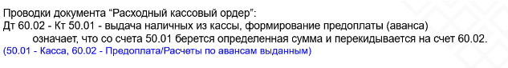

Скачайте каркасную конфигурацию. https://drive.google.com/file/d/1i7nzfIQsUNTu1dkRfw6GXmmBMkt00iPt/view?usp=sharing
Выполните объединение со своей конфигурацией в части следующих объектов:
 a. План видов характеристик “Виды субконто”
 b. План счетов “Хозрасчетный”
 c. Справочник “Виды номенклатуры”
	 

Задания: 
 
 1. Настройте учёт по счету 62.01 как было показано на лекции 3. Для счета 62.01: Субконто1 - Контрагент, Субконто2 - Договор
  
 2. Настройте учёт по счёту 90.01 (выручка) в разрезе видов номенклатуры. Необходимо учитывать только объёмы выручки по данному разрезу (аналитике). Для счета 90.01:  Субконто1 - Вид номенклатуры
   

 3. Настройте создание документа “Приходный кассовый ордер” на основании документа “Реализации товаров”.
 4. Создайте или доработайте документы “Приходный кассовый ордер” и “Реализации товаров” (можно за основу взять уже имеющиеся в ваших конфигурациях документы “ПоступлениеНаБанковсковскийСчет” и “Реализация…”), чтобы в них можно было указать “Договор” и “Вид номенклатуры” для последующего формирования проводок. Создайте недостающие объекты (например “Договор”)
    
    

 5. Сформируйте проводки по регистру бухгалтерии для документов “Приходный кассовый ордер” и “Реализация товаров” на основании требований к проводкам (см. выше)
     
	
	 
	 
	
	 
	 
	
	 

	 
	 
	 
	
	 
	 
	 

 6. Создайте отчет “Взаиморасчеты с покупателями” по счету 62.01.
	 
	 
	 
	 
	 

 
Выгрузите в git информационную базу (dt). 

